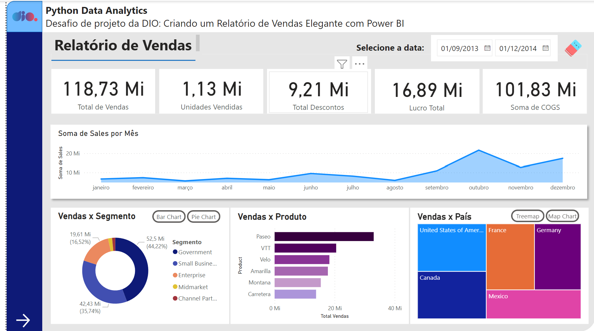

<h1>
    
    Python Data Analytics

</h1>

# :computer: Desafio de projeto: 

## Criando um Relatório de Vendas Elegante com Power BI

### Instruções de Entrega do Desafio

Descrição do desafio: Você irá criar um relatório mais elaborado com base na sample financials do Power BI. Os arquivos de dados estão disponíveis no github: 

https://github.com/julianazanelatto/power_bi_analyst 

Fiquem atentos a: 

* Estrutura definida 

* Botões de navegação que fornecem navegabilidade 

* Segmentadores utilizados e botões com imagem associado 

* Utilize os indicadores e botões para selecionar diferentes visuais sobre um mesmo assunto 

Utilize os vídeos de passo a passo para criação dos elementos que compõem a primeira página do relatório: 

* Objetos que definem o layout do relatório 

* Gráficos (visuais) e os campos que os compõem 

* Botões para navegabilidade 

* Segmentadores de dados 

Lembre-se de: 

* Criar a segunda página do relatório 

* Publique o seu relatório no Power BI Service 

* Caso você tenha familiaridade fique livre para utilizar outros artifícios nos botões e outros 

# :bulb: Solução do desafio

A primeira página foi feita seguindo o passo a passo. Por não ter uma conta institucional não consegui instalar recursos adicionais como o radar chart. 

O relatório está no arquivo projetoDIOrelatorioVendasPowerBI.pbix

Segue um preview das páginas:

